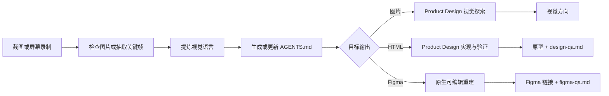

# Reference Design Workflow

把截图或屏幕录制转换成可复用的设计规范，并继续生成视觉方案、经过验证的 HTML 原型，或原生可编辑的 Figma 设计稿。

这个 skill 将「参考资料分析 → 设计上下文 → 目标产物 → 质量验证」串成一次连续工作流。用户不需要手动搬运设计说明，也不需要在多个设计 skill 之间反复切换。

## 它解决什么问题

只告诉 AI“照着这张图做”，很容易丢失真正决定视觉质量的信息：布局层级、字体、间距、色彩、组件关系、图标风格、状态变化和响应式行为。录屏还会带来重复画面、过渡帧、滚动与页面跳转混淆等问题。

`reference-design-workflow` 会先把可观察到的设计规律整理进任务级 `AGENTS.md`，再根据用户目标进入对应路线：

- **图片**：生成多个独立视觉方向，供选择和迭代。
- **HTML**：实现响应式界面，并完成浏览器截图和设计 QA。
- **Figma**：把截图或录屏中的界面还原成原生图层、可编辑文字、Auto Layout、组件与变量，而不是把整张截图贴进画布。

## 工作流



在执行过程中，skill 会：

1. 检查并分析所有可用截图或屏幕录制。
2. 从录屏中提取有代表性的稳定关键帧，保留时间戳并去除重复状态。
3. 提取布局、排版、色彩、间距、表面、组件、图标、动效和响应式原则。
4. 在现有项目中更新根目录 `AGENTS.md`；非项目任务则创建独立的 `design-runs/<slug>/AGENTS.md`。
5. 根据用户目标选择图片、HTML 或 Figma 路线，并完成对应的视觉与结构验证。

## 三种输出路线

### 图片探索

适用于静态视觉探索、概念稿、海报、主视觉和扁平 UI 方案。默认生成 3 个独立方向；用户指定数量时以用户要求为准。

### 可运行 HTML

适用于响应式页面、可操作界面和浏览器原型。若参考图是明确目标，将直接进行高保真实现；若只是风格灵感，会先生成视觉方向供选择，再进入实现。用户明确要求 1:1、像素级或量化对比时，会额外启用截图保真协议：统一裁切、视口、状态和像素密度，按全屏与关键区域反复渲染对比，并把剩余差异写入 `design-qa.md`。

### 可编辑 Figma

适用于“还原到 Figma”“生成可编辑设计稿”或从录屏恢复界面状态。该路线会：

- 为截图记录尺寸、裁切和视口依据。
- 为录屏生成带时间戳的 `reference-map.md`，区分滚动、页面跳转和不同组件状态。
- 使用原生 Frame、Text、Shape、Vector、Auto Layout、组件、实例和变量重建界面。
- 将照片、纹理或复杂插画保留为可替换的图片填充，而非把整个界面栅格化。
- 对实际 Figma Frame 做视觉对比和图层结构检查，并把结果记录在 `figma-qa.md`。

默认目标是忠实还原已有界面，不会在重建过程中擅自重新设计。只有用户明确提出时，才会同时创建新的视觉方向或交互原型。

## 前置条件

- Codex
- 至少一张附件截图、一个本地图片路径，或一段可读取的屏幕录制
- 图片与 HTML 路线：已安装并可用的 **Product Design** plugin
- Figma 路线：可用的 Figma skills、写入工具和目标文件权限
- 录屏分析：建议本机提供 `ffmpeg` 或同类视频工具；无法抽帧时会请求关键截图，不会假装已经检查录屏
- 可选：`image-to-agents-md` skill。若不可用，本 skill 会直接完成同等的视觉提取并写入 `AGENTS.md`
- 可选：`refkit`。可用于网格、取色、边界、字体、截图和差异测量；没有时会使用浏览器截图与本地图像工具完成同一验证闭环

## 安装

安装到当前用户的 Codex skills 目录：

```bash
git clone https://github.com/tototoXD/Reference-Design-workflow.git \
  ~/.codex/skills/reference-design-workflow
```

安装完成后，重新打开 Codex 会话，让 skill 被重新发现。

## 使用示例

根据参考图创建可运行页面：

```text
$reference-design-workflow
参考这些截图，为一个独立书店实现响应式首页，输出可运行的 HTML。
```

生成静态视觉方向：

```text
$reference-design-workflow
沿用附件中的排版、色彩和材质语言，为音乐节 App 设计首页视觉稿。
```

从截图还原 Figma：

```text
$reference-design-workflow
把这些界面截图忠实还原到一个新的 Figma 文件，所有文字和组件都需要可编辑。
```

从录屏恢复页面与状态：

```text
$reference-design-workflow
分析这段操作录屏，把其中出现的页面、弹窗和选中状态还原成可编辑 Figma 设计稿。
```

如果输出格式仍然不明确，skill 只会补问一个关键问题，并仅提供当前任务合理的选项；用户已经选择的格式始终优先。

## 图标与动效

HTML 路线会根据参考图的网格、描边、圆角、填充方式和视觉密度选择一套主要图标库，并在同一界面中保持一致。内置参考覆盖 Material Symbols、Lucide、Heroicons、Tabler Icons、Phosphor，以及仅用于第三方品牌标志的 Simple Icons。

动效优先复用项目现有系统。只有交互确实需要时，才会选择 Motion、Anime.js 或 Swup；简单状态变化使用 CSS transition，并始终考虑 `prefers-reduced-motion`、键盘焦点和快速重复操作。

## 产物

根据任务类型，最终产物包括：

- 任务级或项目级 `AGENTS.md` 设计规范
- 录屏任务的关键帧与 `reference-map.md`
- 多个可供选择的视觉方向
- 或经过浏览器验证的 HTML 原型与 `design-qa.md`
- 精确截图目标还会包含 `capture.json`；使用数值采样时另含可复现的 `probes.json`
- 或经过视觉、结构验证的可编辑 Figma 文件/Frame 链接与 `figma-qa.md`

## 仓库结构

```text
.
├── SKILL.md
├── agents/
│   └── openai.yaml
└── references/
    ├── figma-reconstruction.md
    ├── icon-libraries.md
    ├── motion-libraries.md
    └── screenshot-fidelity.md
```

## 使用边界

- 提炼可复用的视觉原则，不默认复制受保护的品牌标志、文案或独特资产。
- 不把截图中的估算值描述成精确设计 token，也不承诺从录屏恢复不可见的产品逻辑。
- 不用单一的整图相似度分数冒充像素级验证；大面积纯色可能掩盖文字、图标和局部几何误差。
- 不用整屏位图冒充原生可编辑 Figma 设计。
- 不覆盖现有 `AGENTS.md` 中与本任务无关的内容。
- 只生成用户要求的图片、HTML 或 Figma 产物，不会未经请求自动部署或发布页面。

完整执行规则见 [`SKILL.md`](./SKILL.md)。
