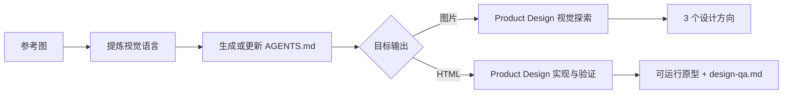

# Reference Design Workflow

把一张或多张视觉参考图，转换成可复用的设计规范，并继续生成视觉方案或经过验证的 HTML 原型。

这个 skill 将「参考图分析 → 设计上下文 → Product Design 生产」串成一次连续工作流。用户不需要手动复制设计说明，也不需要在多个 skill 之间反复切换。

## 它解决什么问题

仅仅告诉 AI“照着这张图做”，经常会丢失真正重要的设计信息：层级、间距、字体、色彩、组件语言、图标风格、动效意图和响应式行为。

`reference-design-workflow` 会先把这些视觉规律整理进任务级 `AGENTS.md`，再将原始参考图和设计规范一起交给 Product Design：

- 静态视觉探索：生成 3 个独立设计方向，供选择和迭代。
- 可运行界面：生成响应式 HTML 原型，并完成浏览器截图与设计 QA。
- 高保真扁平 UI 图片：先用真实组件完成 HTML，再从验证后的页面导出图片。

## 工作流



在执行过程中，skill 会：

1. 检查并分析所有可用参考图。
2. 提取布局、排版、色彩、间距、表面、组件、图标、动效和响应式原则。
3. 在现有项目中更新根目录 `AGENTS.md`；非项目任务则创建独立的 `design-runs/<slug>/AGENTS.md`。
4. 根据用户目标选择图片或 HTML 路线。
5. 将设计规范与原图一起交给 Product Design 完成生成、实现和验证。

## 前置条件

- Codex
- 已安装并可用的 **Product Design** plugin
- 至少一张附件图片，或一个 Codex 可以读取的本地图片路径
- 可选：`image-to-agents-md` skill。若不可用，本 skill 会直接完成同等的视觉提取并写入 `AGENTS.md`

## 安装

安装到当前用户的 Codex skills 目录：

```bash
git clone https://github.com/tototoXD/Reference-Design-workflow.git \
  ~/.codex/skills/reference-design-workflow
```

安装完成后，重新打开 Codex 会话，让 skill 被重新发现。

## 使用示例

上传参考图后直接调用：

```text
$reference-design-workflow
参考这些图片，为一个独立书店设计响应式首页，输出可运行的 HTML。
```

生成静态视觉方向：

```text
$reference-design-workflow
沿用附件中的排版、色彩和材质语言，为音乐节 App 设计首页视觉稿。
```

复刻明确的目标界面：

```text
$reference-design-workflow
把这张界面图实现为响应式 HTML，保留其信息层级与交互状态。
```

如果图片和 HTML 都合理、但用户目的不足以判断，skill 只会补问一个关键问题；明确指定的输出格式始终优先。

## 设计系统处理

### 图标

HTML 路线会根据参考图的网格、描边、圆角、填充方式和视觉密度选择一套主要图标库，并在同一界面中保持一致。内置参考覆盖：

- Material Symbols
- Lucide
- Heroicons
- Tabler Icons
- Phosphor
- Simple Icons（仅用于第三方品牌标志）

### 动效

skill 优先复用项目现有动效系统。只有交互确实需要时，才会选择 Motion、Anime.js 或 Swup；简单状态变化使用 CSS transition，并始终考虑 `prefers-reduced-motion`、键盘焦点和快速重复操作。

## 产物

根据任务类型，最终产物包括：

- 任务级或项目级 `AGENTS.md` 设计规范
- 3 个可供选择的视觉方向（默认数量，可由用户覆盖）
- 或经过浏览器验证的响应式 HTML 原型
- HTML 路线对应的 `design-qa.md`

## 仓库结构

```text
.
├── SKILL.md
├── agents/
│   └── openai.yaml
└── references/
    ├── icon-libraries.md
    └── motion-libraries.md
```

## 使用边界

- 提炼可复用的视觉原则，不默认复制受保护的品牌标志、文案或独特资产。
- 不把截图中的估算值描述成精确设计 token。
- 不覆盖现有 `AGENTS.md` 中与本任务无关的内容。
- 不在未经请求的情况下同时生成图片和 HTML，也不会自动部署或发布页面。

完整执行规则见 [`SKILL.md`](./SKILL.md)。
